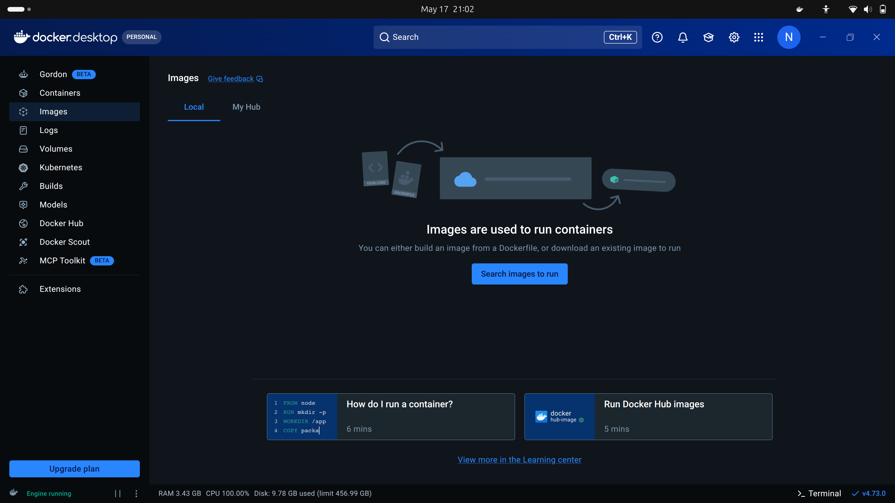
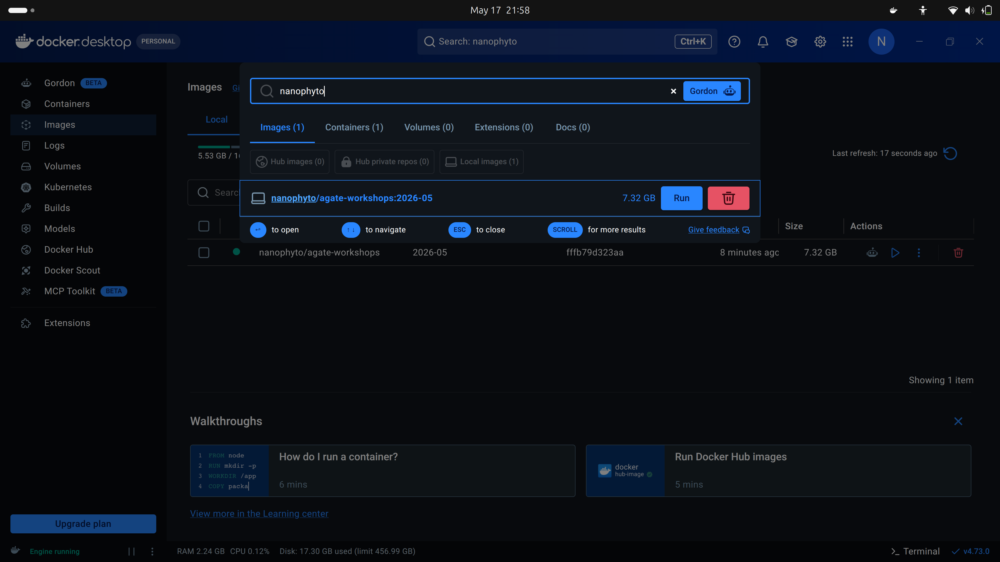

# Agate.jl Workshop Container Setup

This page explains how to install and run the container for the Agate.jl workshop.

The workshop uses Docker so that everyone can run the same software environment without having to install Julia and associated packages manually. Once the container is running, you will open the workshop environment in your web browser and work through the exercises there.

## Step 1: Install Docker Desktop

Install Docker Desktop from:

<https://www.docker.com/products/docker-desktop/>

Choose the installer for your operating system:

- **macOS:** choose the correct version for your Mac, either Apple Silicon or Intel.
- **Windows:** Docker Desktop may ask you to restart your computer during installation.
- **Linux:** follow the Docker Desktop instructions for your distribution.

After installation, open Docker Desktop and wait until it says Docker is running.

Docker Desktop may ask you to sign in or create an account. You should be able to skip this for the workshop. If you already have a Docker account, signing in is also fine.

Once you open Docker Desktop you should see something like below:



## Step 2: Download the workshop image

In Docker Desktop, open the **Images** section and search for:

```text
nanophyto/agate-workshops
```

Pull the workshop image with the tag:

```text
2026-05
```

The full image name is:

```text
nanophyto/agate-workshops:2026-05
```



The download may take some time. Please make sure you have a stable internet connection and enough free disk space (~6.5 GB) before starting.

### Terminal option

If you are comfortable using a terminal, you can pull the image with:

```bash
docker pull nanophyto/agate-workshops:2026-05
```

This does the same thing as pulling the image through Docker Desktop.

## Step 3: Start the workshop container

Once the image has downloaded, start it from Docker Desktop.

1. Go to **Images**.
2. Find `nanophyto/agate-workshops`.
3. Select the `2026-05` tag.
4. Click **Run**.
5. Open **Optional settings**.

Use the following settings:

| Setting | Value |
|---|---|
| Container name | `agate-workshop` |
| Host port | `8888` |
| Container port | `8888` |

If port `8888` is already in use on your computer, use another host port such as `8890`. Keep the container port as `8888`.

Click **Run** to start the container.

On Windows, you may be asked whether Docker is allowed to access private or public networks. Allow access so that your browser can connect to the VS code server running inside the container.

### Terminal option

If you prefer the terminal, you can start the container with:

```bash
docker run --rm -p 8888:8888 nanophyto/agate-workshops:2026-05
```

If port `8888` is already busy, use for example:

```bash
docker run --rm -p 8890:8888 nanophyto/agate-workshops:2026-05
```

In that case, open `http://localhost:8890` instead of `http://localhost:8888`.

## Step 4: Open VS code server in your browser

After the container starts, open your web browser and go to:

<http://localhost:8888>

If you used a different host port, replace `8888` with that number. For example:

<http://localhost:8890>

You should see a vscode interface. This is where we will run the workshop examples.

## Step 5: Check that the environment works

Inside VS code, open the `00_setup_check.jl` script provided in the examples. Run the setup check script, if it runs without failing you are setup.

The check should confirm that Julia starts and that the main workshop packages can be loaded.