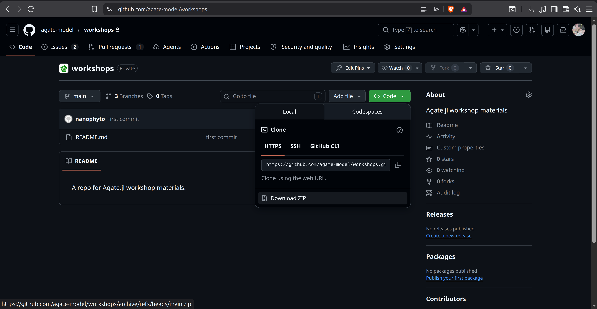
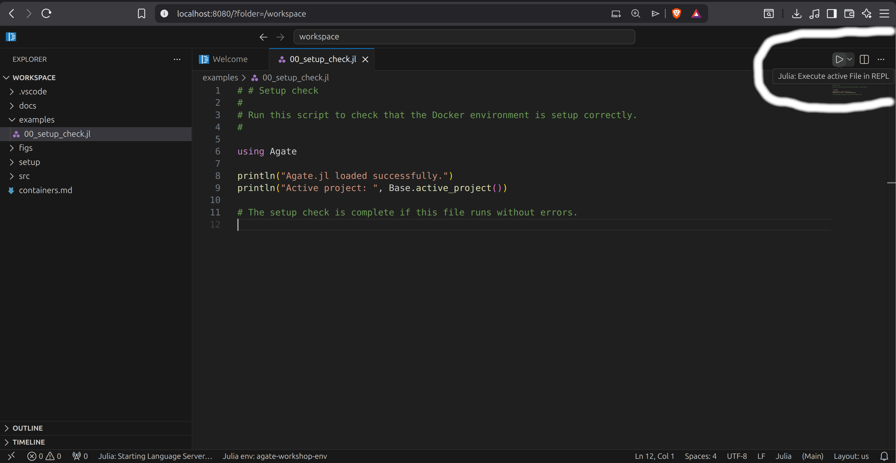

# Agate.jl Workshop Container Setup

This page explains how to install and run the container for the Agate.jl workshop.

The workshop uses Docker so that everyone can run the same software environment without having to install Julia and associated packages manually. The workshop materials are stored separately on GitHub. You will download the materials to your own computer, then attach that folder to the Docker container.

---

## Step 1: Install Docker Desktop

Install Docker Desktop from:

<https://www.docker.com/products/docker-desktop/>

Choose the installer for your operating system:

- **macOS:** choose the correct version for your Mac, either Apple Silicon or Intel.
- **Windows:** Docker Desktop may ask you to restart your computer during installation.
- **Linux:** follow the Docker Desktop instructions for your distribution.

After installation, open Docker Desktop and wait until it says Docker is running.

Docker Desktop may ask you to sign in or create an account. You should be able to skip this for the workshop. If you already have a Docker account, signing in is also fine.

Once you open Docker Desktop you should see something like below:


---

## Step 2: Download the workshop materials from GitHub

You need a local copy of the workshop materials before starting the container.

There are two options:

1. **Download manually from the browser** — recommended if you do not use Git.
2. **Clone with Git** — recommended if you already use Git.

### Option A: download manually from the browser

1. Open the workshop repository:

   <https://github.com/agate-model/workshops>

2. Click the green **Code** button.



3. Click **Download ZIP**.

4. Unzip the downloaded file.

5. Inside the unzipped folder, find the workshop folder:

   ```text
   2026-5
   ```

6. Move this folder somewhere easy to find, for example:

   - macOS: `Documents/AgateWorkshop/2026-5`
   - Windows: `Documents\AgateWorkshop\2026-5`
   - Linux: `~/AgateWorkshop/2026-5`

This `2026-5` folder is the folder you will attach to Docker as a Volume.

### Option B: clone with Git

If you already use Git, open a terminal and run:

```bash
git clone https://github.com/agate-model/workshops.git
```

Then move into the workshop folder:

```bash
cd workshops/2026-5
```

The folder `workshops/2026-5` is the folder you will attach to Docker as a Volume.

### Check the folder

Whichever option you used, the workshop folder should contain files or folders such as:

```text
examples/
docs/
src/
README.md
```

---

## Step 3: Download the workshop image

In Docker Desktop, open the **Images** section and search for:

```text
nanophyto/agate-workshops
```

Pull the workshop image with the tag:

```text
2026-05
```

The full image name is:

```text
nanophyto/agate-workshops:2026-05
```


The download may take some time. Please make sure you have a stable internet connection and enough free disk space, approximately 7.5 GB or more, before starting.

### Terminal option

If you are comfortable using a terminal, you can pull the image with:

```bash
docker pull nanophyto/agate-workshops:2026-05
```

This does the same thing as pulling the image through Docker Desktop.

---

## Step 4: Start the workshop container and attach the materials as a Volume

Once the image has downloaded, start it from Docker Desktop.

1. Go to **Images**.
2. Find `nanophyto/agate-workshops`.
3. Select the `2026-05` tag.
4. Click **Run**.
5. Open **Optional settings**.

Use the following settings:

| Setting | Value |
|---|---|
| Container name | `agate-workshop` |
| Host port | `8888` |
| Container port | `8888` |
| Host path | the `2026-5` workshop folder on your computer |
| Container path | `/workspace` |

The **Host path** is the folder you downloaded from GitHub. For example:

```text
Documents/AgateWorkshop/2026-5
```

The **Container path** must be exactly:

```text
/workspace
```

This Volume setting is important. It lets the container see the workshop files, and it lets your edited scripts, outputs, and figures be saved back to your own computer.

If port `8888` is already in use on your computer, use another host port such as `8890`. Keep the container port as `8888`.

Click **Run** to start the container.

On Windows, you may be asked whether Docker is allowed to access private or public networks. Allow access so that your browser can connect to the VS Code server running inside the container.

### Terminal option

If you prefer the terminal, run the command from inside the `2026-5` workshop folder.

On macOS or Linux:

```bash
docker run --rm -p 8888:8888 -v "$PWD:/workspace" nanophyto/agate-workshops:2026-05
```

On Windows PowerShell:

```powershell
docker run --rm -p 8888:8888 -v "${PWD}:/workspace" nanophyto/agate-workshops:2026-05
```

If port `8888` is already busy, use another host port, for example:

```bash
docker run --rm -p 8890:8888 -v "$PWD:/workspace" nanophyto/agate-workshops:2026-05
```

On Windows PowerShell:

```powershell
docker run --rm -p 8890:8888 -v "${PWD}:/workspace" nanophyto/agate-workshops:2026-05
```

In that case, open `http://localhost:8890` instead of `http://localhost:8888`.

---

## Step 5: Open VS Code server in your browser

After the container starts, open your web browser and go to:

<http://localhost:8888>

If you used a different host port, replace `8888` with that number. For example:

<http://localhost:8890>

You should see a VS Code interface. This is where we will run the workshop examples.

The file browser inside VS Code should show the contents of the workshop folder. If it does not, the Volume was probably not configured correctly. Stop the container and check that:

- the Host path points to the local `2026-5` folder;
- the Container path is `/workspace`.

---

## Step 6: Check that the environment works

Inside VS Code, open the setup check script in the workshop folder. It should be in:

```text
examples/00_setup_check.jl
```

You can run the script from the GUI by pressing the **play** icon:




Alternatively, you can run the script from the VS Code terminal:

```bash
julia examples/00_setup_check.jl
```

The check should confirm that Julia starts and that the main workshop packages can be loaded.

You can also check the Julia environment manually by opening a Julia REPL and running:

```julia
Base.active_project()
```

It should point to the workshop environment inside the container.
