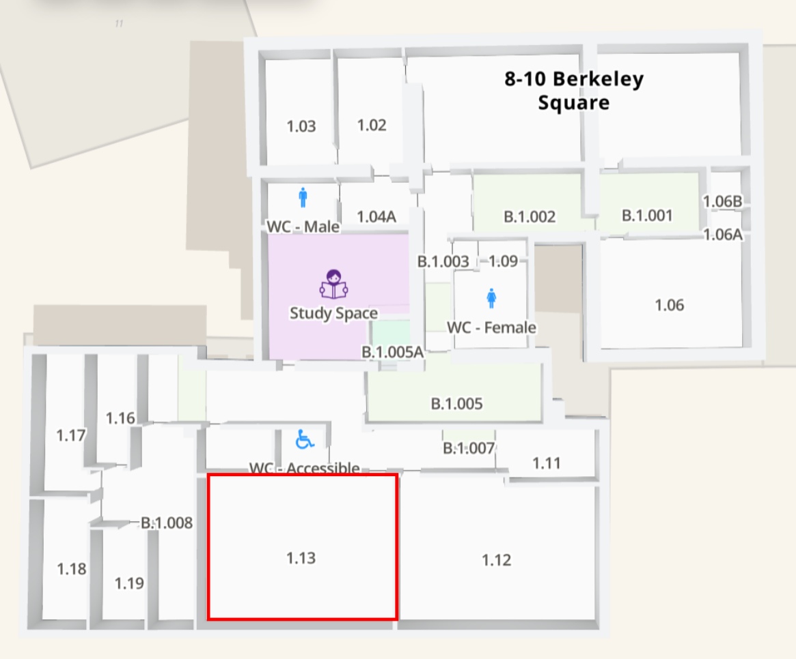
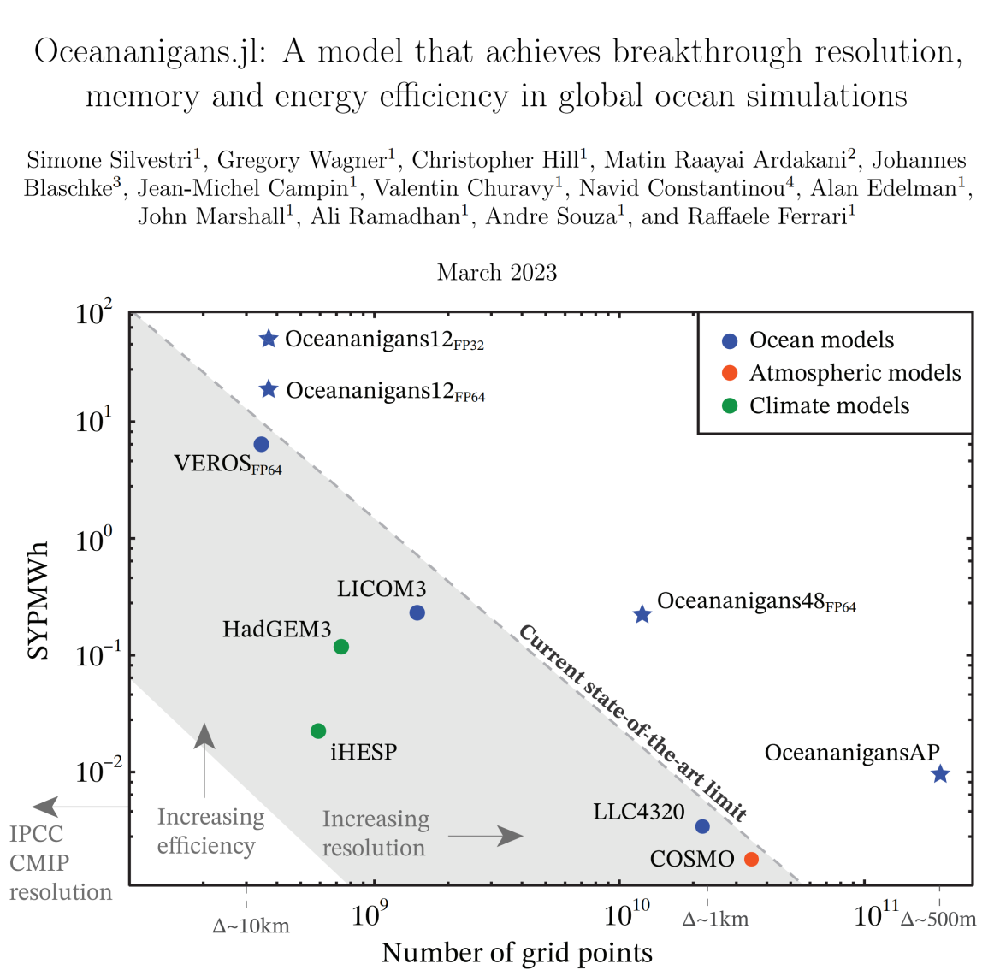
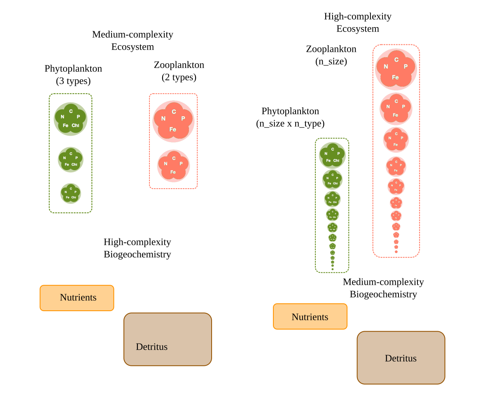
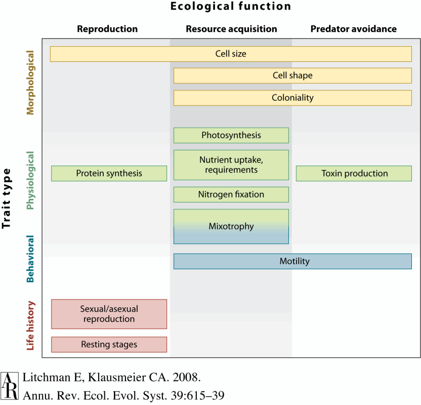
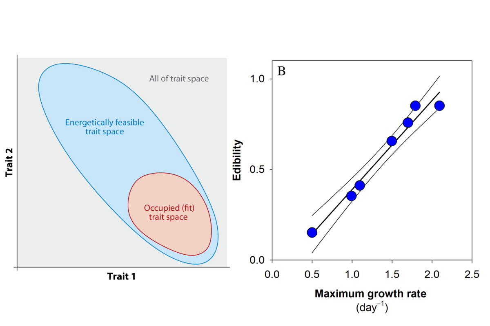
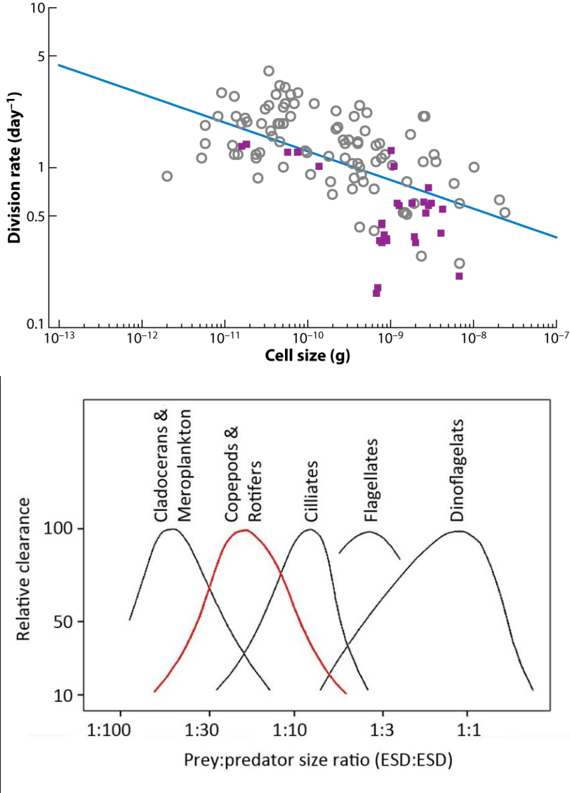
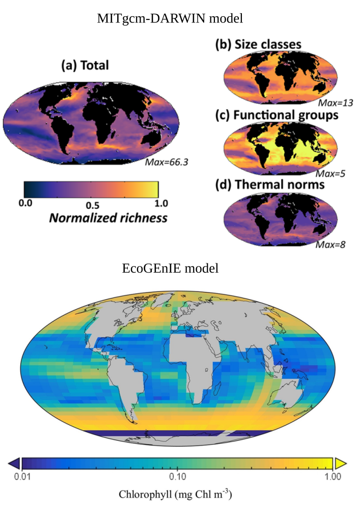

## Welcome {background-image="images/background-placeholder.svg" background-size="cover"}

::: {.slide-copy}

| Time | Session |
|---|---|
| 09:30–10:00 | *Docker setup (optional, this can be done before the workshop)* |
| 10:00–10:30 | Welcome and workshop overview |
| 10:30–11:10 | Session 1: Size, allometry, and plankton traits |
| 11:10–11:25 | Break |
| 11:25–12:05 | Session 2: Predation and trophic structure |
| 12:05–12:45 | Session 3: Physical forcing: light and diffusivity  |
| 12:45–13:45 | Lunch |
| 13:45–14:35 | Group exercise |
| 14:35–15:10 | Own-work block 1 |
| 15:10–15:40 | Break |
| 15:40–16:30 | Own-work block 2 |
| 16:30–16:55 | Show-and-tell (optional) and feedback |
| 16:55–17:00 | Wrap-up |
| 17:00       | Pub |

:::

::: {.slide-figure}

Map of Berkley Square 8-10 (from [mazemap](https://use.mazemap.com/#v=1&config=UoBCampuses&campusid=843&center=-2.606670,51.454875&zoom=20&zlevel=2)).

:::

## Current state of the art {background-image="images/background-placeholder.svg" background-size="cover"}

::: {.slide-copy}

All major Earth System Models (ESMs) use FORTRAN.

- Highly optimized and battle tested
- Large user base / existing expertise
- Physical system well calibrated (circulation, boundary conditions)

Downsides:

- First appeared in 1957; 69 years ago
- Ocean biogeochemistry often secondary/tertiary
- Non-composable -> iron cycling for PISCES can't be used in DARWIN
- Hard to Automatically Differentiate -> makes Bayesian inference and machine learning expensive!
- Difficult to utilize GPUs (but increasingly possible)

:::

::: {.slide-figure}

Legacy Earth system model infrastructure and FORTRAN-based scientific computing.

:::

## Julia programming language - a new frontier ? {background-image="images/background-placeholder.svg" background-size="cover"}

::: {.slide-copy}

Benefits:

- Similar performance to FORTRAN but easier to program (like Python, R, MATLAB)
- Designed to be composable (at least in theory)
- Strong Automatic Differentiation infrastructure
- GPUs well supported
- Existing physical oceanography model (Oceananigans.jl) and an active Earth System Modelling community (NumericalEarth.jl)

Downsides:

- Effectively starting from scratch (ESMs are complex(!))
- Small user base / expertise
- While theoretically easy to use, plotting etc. is still behind Python/R
- Senior PI's are hesitant to learn a new language
- FORTRAN has stood the test of time, will Julia?

:::

::: {.slide-figure}

Julia as a bridge between expressive scientific code and high-performance simulation.

:::

## From monolithic models to composable components {background-image="images/background-placeholder.svg" background-size="cover"}

::: {.slide-copy}
- Monolithic workflow: physical model, numerics, ecosystem equations, parameters, and diagnostics are tightly coupled.
- Composable workflow: ecosystem components are specified through interfaces and coupled to different contexts.
- Reusable components make model variants easier to compare.
- Composability supports a distributed climate model made from interoperable packages.
:::

::: {.slide-figure}

Composable components make model variants easier to assemble and compare.

:::

## The wider Julia climate and ocean ecosystem {background-image="images/background-placeholder.svg" background-size="cover"}

::: {.slide-copy}
Clima and NumericalEarth.jl ecosystem  
↓  
Oceananigans.jl: ocean physics and simulation  
↓  
OceanBioME.jl: biogeochemistry and ecosystem coupling  
↓  
Agate.jl: aquatic ecosystem model construction
:::

::: {.slide-figure}

Agate.jl in the broader Julia climate and ocean software ecosystem.

:::

## Why Julia for this? {background-image="images/background-placeholder.svg" background-size="cover"}

::: {.slide-copy}
- High-level expression: model ideas can be written close to the scientific abstraction.
- Performance: numerical code can run efficiently without moving to a separate implementation language.
- Multiple dispatch: components can share interfaces while specializing behavior.
- GPU support: important for high-resolution ocean and climate simulations.
- Automatic differentiation: a long-term route toward tunable and calibratable model components.
:::

::: {.slide-figure}

Julia features relevant to ecosystem model development.

:::

## What does Agate.jl stand for? {background-image="images/background-placeholder.svg" background-size="cover"}

::: {.slide-copy}
| Term | Meaning |
|---|---|
| Aquatic | Aquatic ecosystem and biogeochemical model components. |
| GCM-agnostic | Components should not be tied to one circulation model or physical host. |
| Tunable | Long-term goal: components that can be calibrated, optimized, differentiated, and tested systematically. |
| Ecosystems | Communities, traits, interactions, and process structure. |
:::

::: {.slide-figure}

The Agate.jl acronym connects scope, portability, tuning, and ecosystems.

:::

## Trait-based approaches {background-image="images/background-placeholder.svg" background-size="cover"}

::: {.slide-copy}
- XX species in ocean
- Trait based frameworks provide first-principles constraints
:::

::: {.slide-figure}

Agate.jl as a higher-level interface for constructing model variants.

:::

## Emergent ecosystems {background-image="images/background-placeholder.svg" background-size="cover"}

::: {.slide-copy}
- Models are not copies of nature; they are simplified arguments about mechanisms.
- A useful model edit should correspond to a clear assumption.
- A useful experiment compares alternatives, not just isolated runs.
- Interpretation requires a diagnostic: what output would show whether the assumption mattered?
:::

::: {.slide-figure}

Model edits as explicit ecological assumptions and comparisons.

:::

## Allometry {background-image="images/background-placeholder.svg" background-size="cover"}

::: {.slide-copy}
- Plankton communities are diverse and difficult to represent species by species.
- Trait-based models represent ecological strategies rather than every named organism.
- Traits connect biological differences to model processes.
- This makes it easier to construct families of model variants.
:::

::: {.slide-figure}

Traits provide handles for representing ecological strategies.

:::

## Why allometry? {background-image="images/background-placeholder.svg" background-size="cover"}

::: {.slide-copy}
- Allometry describes how biological quantities scale with organism size or other traits.
- It reduces the number of independent parameters that must be assigned manually.
- It makes modelling assumptions explicit and reusable.
- It helps construct related model types from shared rules.
:::

::: {.slide-figure}

Allometric rules generate structured parameter variation from shared assumptions.

:::

## A simple workflow for the day {background-image="images/background-placeholder.svg" background-size="cover"}

::: {.slide-copy}
Ecological question  
↓  
Model assumption  
↓  
Agate.jl constructor or setup choice  
↓  
Model run  
↓  
Diagnostic and interpretation
:::

::: {.slide-figure}

A common workflow from ecological question to diagnostic interpretation.

:::

## Roadmap without pre-teaching the modules {background-image="images/background-placeholder.svg" background-size="cover"}

::: {.slide-copy}
| Part of workshop | Role in the day |
|---|---|
| Opening lecture | Why this software and modelling approach exists. |
| Short module lectures | Introduce the concepts needed for each hands-on exercise. |
| Hands-on modules | Practice constructing and modifying model variants. |
| Self-paced examples | Apply the workflow to a chosen ecological question. |
:::

::: {.slide-figure}

Workshop structure: short concepts followed by hands-on model construction.

:::

## Final takeaway {background-image="images/background-placeholder.svg" background-size="cover"}

::: {.slide-copy}
- Agate.jl is motivated by transferable, GCM-agnostic ecosystem model components.
- Julia supports a composable, high-performance, and eventually tunable modelling ecosystem.
- Trait-based and allometric abstractions help turn ecological assumptions into reusable model structure.
- The rest of the workshop will introduce concepts only when they are needed for the exercises.
:::

::: {.slide-figure}

The central workshop motivation: transferable, composable ecosystem models.

:::