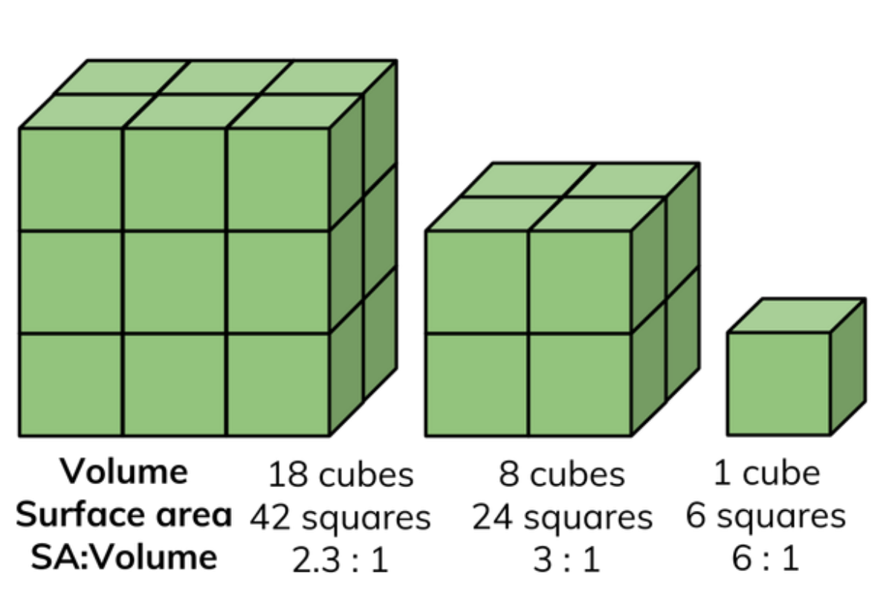
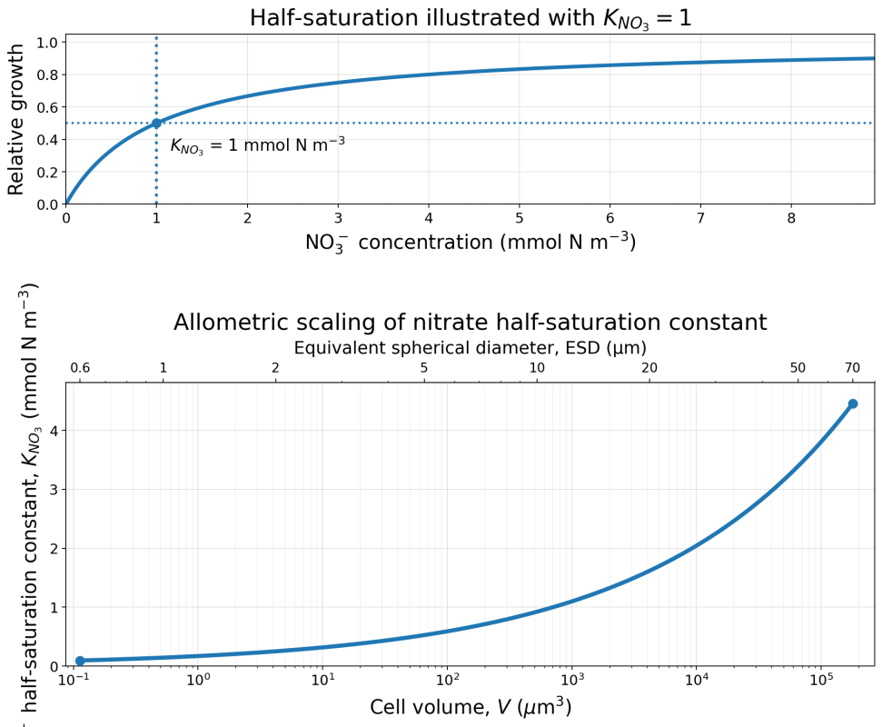

## Size as fundamental trait {background-image="images/background-placeholder.svg" background-size="cover"}

::: {.slide-copy}
- Universal trait (bacteria to whales)
- Huge size range of plankton in ocean
:::

::: {.slide-figure}

Modified from: Holland & McQuatters-Gollop (2024). mNCEA policy brief – The many scales of pelagic habitats. Defra mNCEA Programme – Pelagic Natural Capital. University of Plymouth.

:::

## Surface Area to Volume {background-image="images/background-placeholder.svg" background-size="cover"}

::: {.slide-copy}
- Allometric scaling a function of SA:V ratio
:::

::: {.slide-figure}

Replace with the workflow or diagnostic used in this module.

:::

## Maximum growth rate {background-image="images/background-placeholder.svg" background-size="cover"}

::: {.slide-copy}
- Allometric scaling a function of SA:V ratio
:::

::: {.slide-figure}

Replace with the workflow or diagnostic used in this module.

:::

## Maximum grazing rate {background-image="images/background-placeholder.svg" background-size="cover"}

::: {.slide-copy}
- growth vs prey
:::

::: {.slide-figure}

Replace with the workflow or diagnostic used in this module.

:::

## Nutrient half saturation {background-image="images/background-placeholder.svg" background-size="cover"}

::: {.slide-copy}
- nutrients vs growth
:::

::: {.slide-figure}

Replace with the workflow or diagnostic used in this module.

:::

## Allometric scaling {background-image="images/background-placeholder.svg" background-size="cover"}

::: {.slide-copy}
- aV^b
:::

::: {.slide-figure}

Replace with the workflow or diagnostic used in this module.

:::

## Number of groups {background-image="images/background-placeholder.svg" background-size="cover"}

::: {.slide-copy}
- How many are needed to capture diversity?
:::

::: {.slide-figure}

Replace with the workflow or diagnostic used in this module.

:::

## Size ranges {background-image="images/background-placeholder.svg" background-size="cover"}

::: {.slide-copy}
- Are there physiological limitations?
- Biogeochemical ones?
- Physics (e.g. sinking)?
:::

::: {.slide-figure}

Replace with the workflow or diagnostic used in this module.

:::