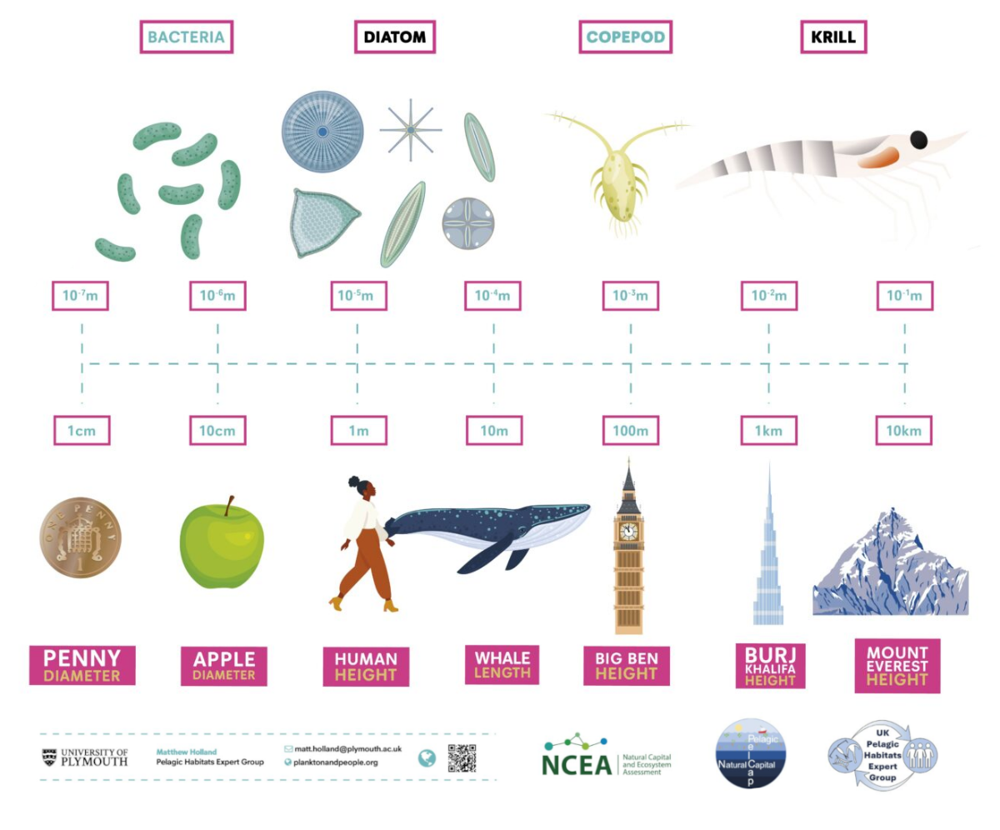

## Size as fundamental trait {background-image="images/background-placeholder.svg" background-size="cover"}

::: {.slide-copy}
- Universal trait (bacteria to whales)
- Huge size range of plankton in ocean
:::

::: {.slide-figure}

Replace with a module-specific figure caption.

:::

## Surface Area to Volume {background-image="images/background-placeholder.svg" background-size="cover"}

::: {.slide-copy}
- Allometric scaling a function of SA:V ratio
:::

::: {.slide-figure}

Replace with the workflow or diagnostic used in this module.

:::

## Maximum growth rate {background-image="images/background-placeholder.svg" background-size="cover"}

::: {.slide-copy}
- Allometric scaling a function of SA:V ratio
:::

::: {.slide-figure}

Replace with the workflow or diagnostic used in this module.

:::

