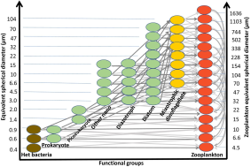
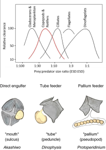
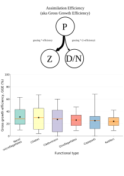
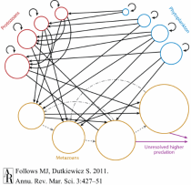
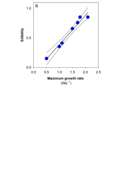

## Predation and trophic structure {background-image="images/background-placeholder.svg" background-size="cover"}

::: {.slide-copy}
- 
:::

::: {.slide-figure}

Image from Dutkiewicz et al., 2024 (L&O).

:::

## Palatability {background-image="images/background-placeholder.svg" background-size="cover"}

::: {.slide-copy}
- 
:::

::: {.slide-figure}

Replace with the diagnostic or comparison for this module.

:::

## Size optima {background-image="images/background-placeholder.svg" background-size="cover"}

::: {.slide-copy}
- 
:::

::: {.slide-figure}

Hansen 1994, and from Garcia-Oliva and Wirtz 2022.

:::

## Assimilation efficiency {background-image="images/background-placeholder.svg" background-size="cover"}

::: {.slide-copy}
- Also known as Gross Growth Efficiency (GGE)
:::

::: {.slide-figure}

Data replotted from Straile 1997.

:::

## Unresolved higher predation {background-image="images/background-placeholder.svg" background-size="cover"}

::: {.slide-copy}
- 
:::

::: {.slide-figure}

Image from Follows and Dutkiewicz, 2011 (Annu. Rev. Mar. Sci).

:::

## Trade-offs {background-image="images/background-placeholder.svg" background-size="cover"}

::: {.slide-copy}
- 
:::

::: {.slide-figure}

Replace with the diagnostic or comparison for this module.

:::

