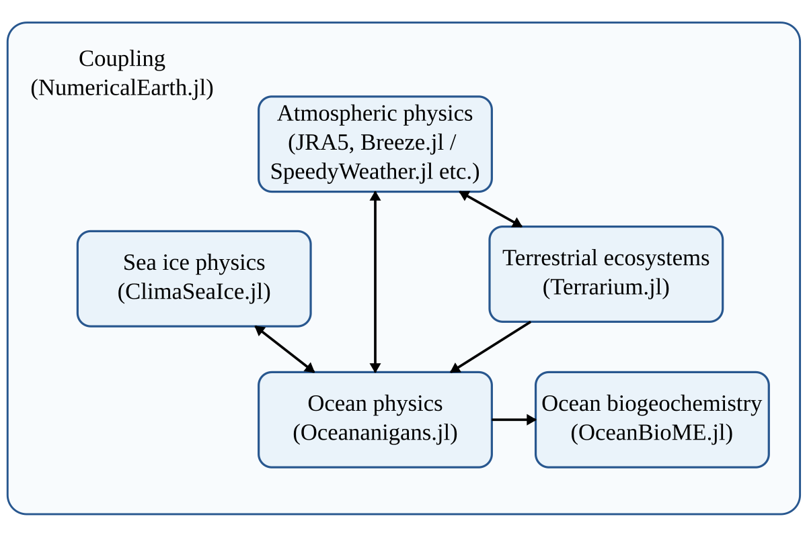
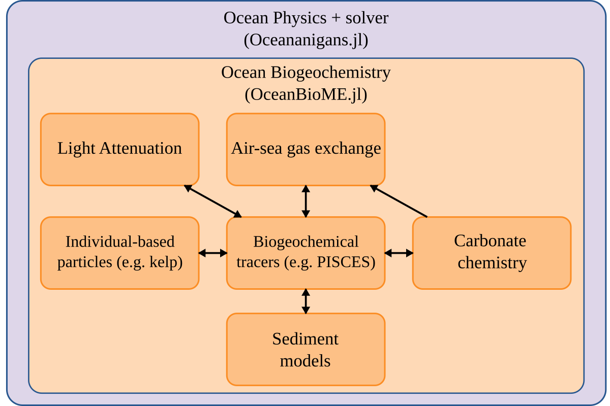
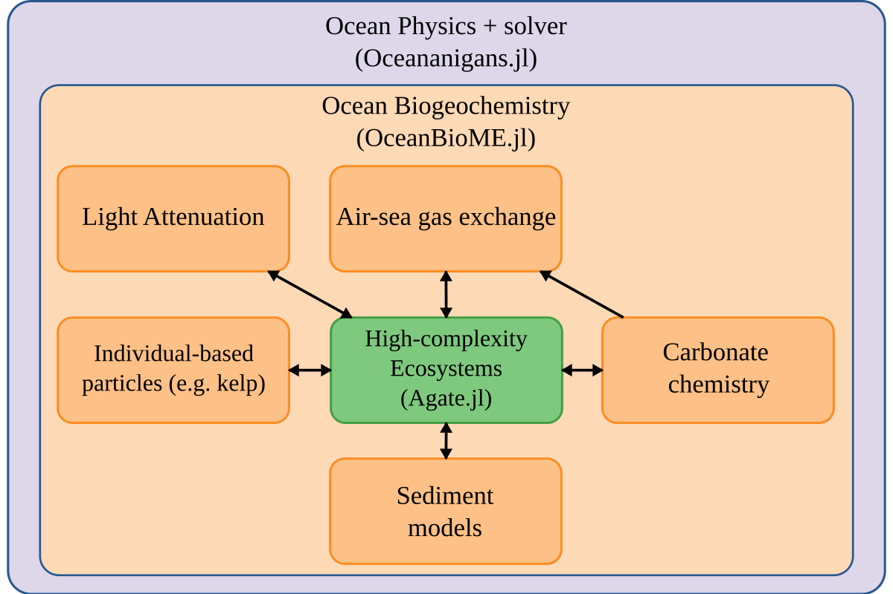
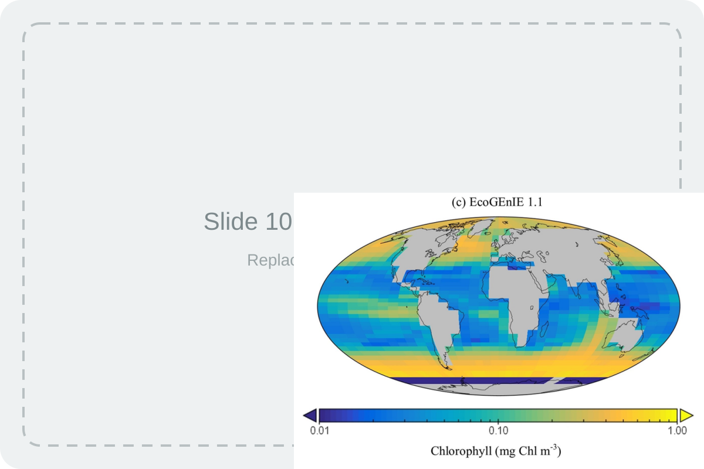
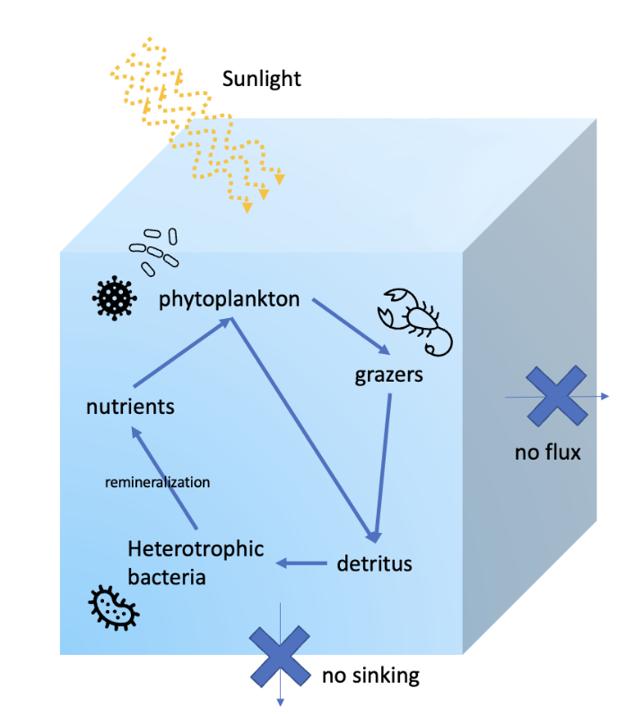
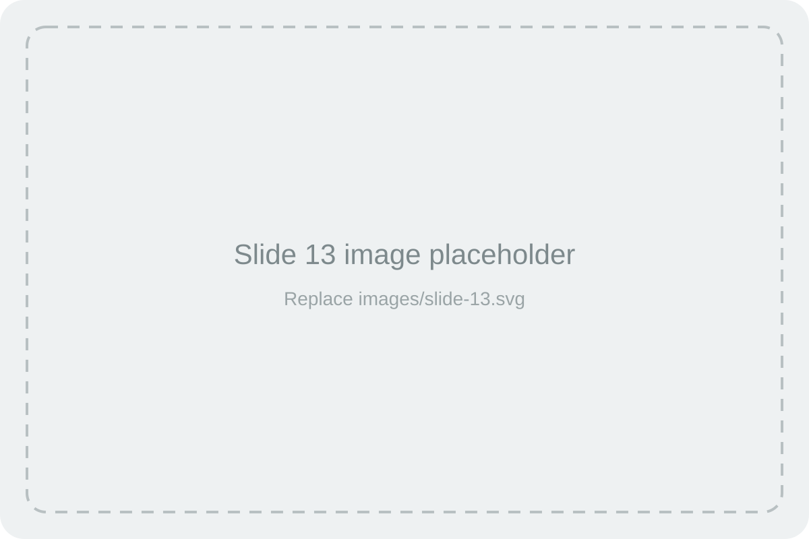

## Current state of the art {background-image="images/background-placeholder.svg" background-size="cover"}

::: {.slide-copy}

All major Earth System Models (ESMs) use FORTRAN.

- Highly optimized and battle tested
- Large user base / existing expertise
- Physical system well calibrated (circulation, boundary conditions)

Downsides:

- Ocean biogeochemistry often secondary/tertiary
- Non-composable -> iron cycling for PISCES can't be used in DARWIN
- Written in FORTRAN -> less intuitive + worse UX than modern languages
- Hard to Automatically Differentiate -> makes Bayesian inference and machine learning expensive!
- Difficult to utilize GPUs (but increasingly possible)

:::

{.slide-image}

## Julia programming language - a new frontier ? {background-image="images/background-placeholder.svg" background-size="cover"}

::: {.slide-copy}

Benefits:

- Similar performance to FORTRAN but easier to program (like Python, R, MATLAB)
- Designed to be composable (at least in theory)
- Strong Automatic Differentiation infrastructure
- GPUs well supported
- Existing physical oceanography model (Oceananigans.jl) and an active Earth System Modelling community (NumericalEarth.jl)

Downsides:

- Effectively starting from scratch (ESMs are complex(!))
- Small user base / expertise
- While theoretically easy to use, plotting etc. is still behind Python/R
- Senior PI's are hesitant to learn a new language
- FORTRAN has stood the test of time, will Julia?

:::

{.slide-image}

## From monolithic models to composable components {background-image="images/background-placeholder.svg" background-size="cover"}

::: {.slide-copy}
- Monolithic workflow: physical model, numerics, ecosystem equations, parameters, and diagnostics are tightly coupled.
- Composable workflow: ecosystem components are specified through interfaces and coupled to different contexts.
- Reusable components make model variants easier to compare.
- Composability supports a distributed climate model made from interoperable packages.
:::

{.slide-image}

## The wider Julia climate and ocean ecosystem {background-image="images/background-placeholder.svg" background-size="cover"}

::: {.slide-copy}
Clima and NumericalEarth.jl ecosystem  
↓  
Oceananigans.jl: ocean physics and simulation  
↓  
OceanBioME.jl: biogeochemistry and ecosystem coupling  
↓  
Agate.jl: aquatic ecosystem model construction
:::

{.slide-image}

## Why Julia for this? {background-image="images/background-placeholder.svg" background-size="cover"}

::: {.slide-copy}
- High-level expression: model ideas can be written close to the scientific abstraction.
- Performance: numerical code can run efficiently without moving to a separate implementation language.
- Multiple dispatch: components can share interfaces while specializing behavior.
- GPU support: important for high-resolution ocean and climate simulations.
- Automatic differentiation: a long-term route toward tunable and calibratable model components.
:::

{.slide-image}

## What does Agate.jl stand for? {background-image="images/background-placeholder.svg" background-size="cover"}

::: {.slide-copy}
| Term | Meaning |
|---|---|
| Aquatic | Aquatic ecosystem and biogeochemical model components. |
| GCM-agnostic | Components should not be tied to one circulation model or physical host. |
| Tunable | Long-term goal: components that can be calibrated, optimized, differentiated, and tested systematically. |
| Ecosystems | Communities, traits, interactions, and process structure. |
:::

{.slide-image}

## What Agate.jl should give the user {background-image="images/background-placeholder.svg" background-size="cover"}

::: {.slide-copy}
- A way to specify ecosystem model structure at a higher level.
- A way to construct model variants from ecological assumptions.
- A way to separate the scientific question from low-level implementation details.
- A path toward reusable ecosystem components across physical contexts.
:::

{.slide-image}

## Models as controlled ecological arguments {background-image="images/background-placeholder.svg" background-size="cover"}

::: {.slide-copy}
- Models are not copies of nature; they are simplified arguments about mechanisms.
- A useful model edit should correspond to a clear assumption.
- A useful experiment compares alternatives, not just isolated runs.
- Interpretation requires a diagnostic: what output would show whether the assumption mattered?
:::

{.slide-image}

## Why trait-based modelling? {background-image="images/background-placeholder.svg" background-size="cover"}

::: {.slide-copy}
- Plankton communities are diverse and difficult to represent species by species.
- Trait-based models represent ecological strategies rather than every named organism.
- Traits connect biological differences to model processes.
- This makes it easier to construct families of model variants.
:::

{.slide-image}

## Why allometry? {background-image="images/background-placeholder.svg" background-size="cover"}

::: {.slide-copy}
- Allometry describes how biological quantities scale with organism size or other traits.
- It reduces the number of independent parameters that must be assigned manually.
- It makes modelling assumptions explicit and reusable.
- It helps construct related model types from shared rules.
:::

{.slide-image}

## A simple workflow for the day {background-image="images/background-placeholder.svg" background-size="cover"}

::: {.slide-copy}
Ecological question  
↓  
Model assumption  
↓  
Agate.jl constructor or setup choice  
↓  
Model run  
↓  
Diagnostic and interpretation
:::

{.slide-image}

## Roadmap without pre-teaching the modules {background-image="images/background-placeholder.svg" background-size="cover"}

::: {.slide-copy}
| Part of workshop | Role in the day |
|---|---|
| Opening lecture | Why this software and modelling approach exists. |
| Short module lectures | Introduce the concepts needed for each hands-on exercise. |
| Hands-on modules | Practice constructing and modifying model variants. |
| Self-paced examples | Apply the workflow to a chosen ecological question. |
:::

{.slide-image}

## Final takeaway {background-image="images/background-placeholder.svg" background-size="cover"}

::: {.slide-copy}
- Agate.jl is motivated by transferable, GCM-agnostic ecosystem model components.
- Julia supports a composable, high-performance, and eventually tunable modelling ecosystem.
- Trait-based and allometric abstractions help turn ecological assumptions into reusable model structure.
- The rest of the workshop will introduce concepts only when they are needed for the exercises.
:::

{.slide-image}
